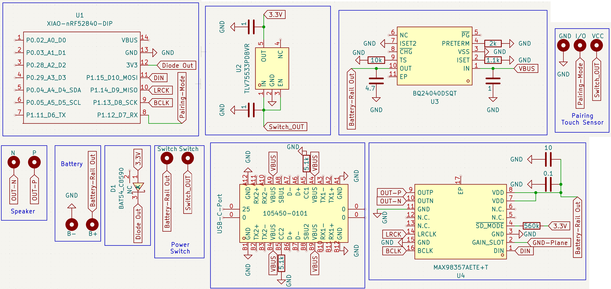
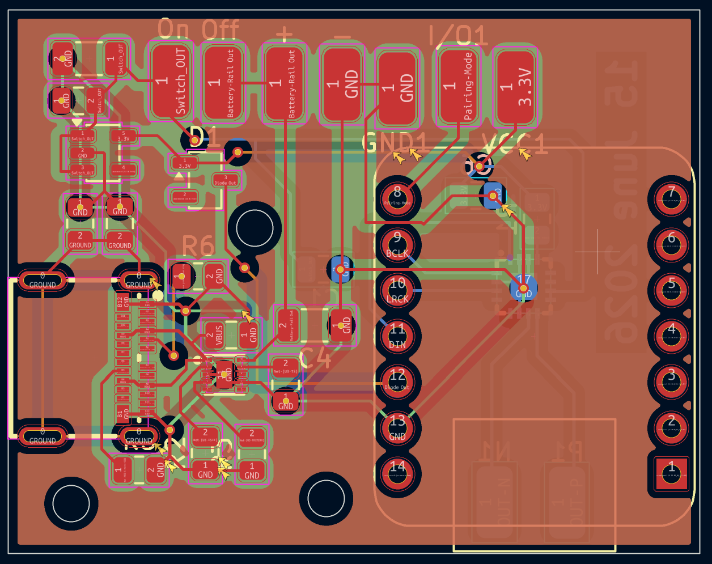

# Jazz

Jazz is a bluetooth speaker that uses ESP32 for bluetooth connection

It focuses on minimalism and uses Audiophile grade equipments for good soundquality

### Features:

 - Compact design 
 - Capacitive Sensor to enter pairing mode
 - Toggle switch to On-Off speaker.
 - Daytone Speaker and Passive Radiator

### CAD Model:
It has 3 separate printed pieces. The Enclousure, the Speaker Holder to support driver and passive radiator, and Top mesh to cover driver.
Made in Autodesk Fusion.

### PCB:
Here's my PCB! It was made in KiCad. 

Schematic : 
PCB Footprint : 

### Firmware Overview:
Currently Firmware is underdevelopment so there is some time to finished product.
This speaker uses C++ firmware and Arduino IDE for Flashing.

### BOM Table
|Name|Use|Quantity|Distributer|
|-----|---|-------|-----------|
|Battery|Power Source|1|Robu|
|PCB|Main-Circuit|1|JLCPCB|
|Toggle switch|On-Off|1|Amazon|
|XIAO nRF52840|Bluetooth SoC|1|Amazon|
|Speaker|Main Driver|1|Parts Express|
|Dayton Audio ND65-PR|Radiator for Depth|1|Parts Express|
|Dayton Audio ND65-PR|Radiator for Depth|1|Parts Express|
